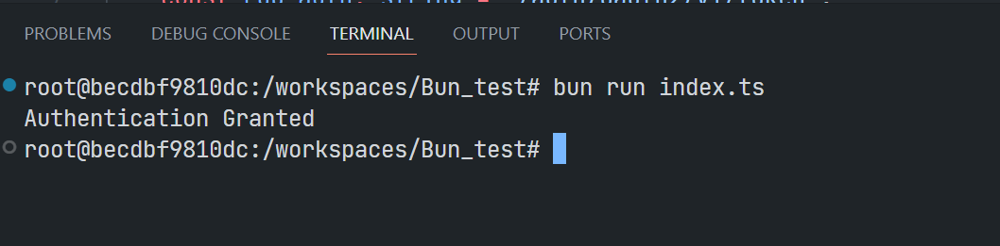

# Experimenting Bun JavaScript Runtime with Data Library - TypeScript

Example Code Disclaimer:
ALL EXAMPLE CODE IS PROVIDED ON AN “AS IS” AND “AS AVAILABLE” BASIS FOR ILLUSTRATIVE PURPOSES ONLY. REFINITIV MAKES NO REPRESENTATIONS OR WARRANTIES OF ANY KIND, EXPRESS OR IMPLIED, AS TO THE OPERATION OF THE EXAMPLE CODE, OR THE INFORMATION, CONTENT, OR MATERIALS USED IN CONNECTION WITH THE EXAMPLE CODE. YOU EXPRESSLY AGREE THAT YOUR USE OF THE EXAMPLE CODE IS AT YOUR SOLE RISK.

## <a id="overview"></a>Overview

[Bun](https://bun.sh/) is a new JavaScript runtime that aims to be *a drop-in replacement for [Node.js](https://nodejs.org/en/)* with faster startup and run time, more optimized API, and provides a complete toolkit for JavaScript/TypeScript developers.

Bun [just released version 1.0](https://www.youtube.com/watch?v=BsnCpESUEqM) ("production-ready") on September 2023 (the current version is 1.0.21, as of January 2024).

One of Bun features is the [Node.js compatibility](https://bun.sh/docs/runtime/nodejs-apis). Most [NPM](https://www.npmjs.com/) modules intended to work with Node.js will work with Bun out of the box. This is a good opportunity to test [Data Library for TypeScript](https://developers.lseg.com/en/api-catalog/refinitiv-data-platform/refinitiv-data-library-for-typescript) with Bun runtime to consume data from [Data Platform](https://developers.lseg.com/en/api-catalog/refinitiv-data-platform/refinitiv-data-platform-apis) (aka Delivery Platform or RDP, formerly known as Refinitiv Data Platform) as an experimental project.

This example project shows how to implement a console [TypeScript](https://www.typescriptlang.org) application to retrieve financial data using ease-of-use [Data Library for TypeScript version 1](https://developers.lseg.com/en/api-catalog/refinitiv-data-platform/refinitiv-data-library-for-typescript) on Bun runtime.  The project is implemented and run in a controlled environment such as [Docker](https://www.docker.com/) and [devcontainer](https://code.visualstudio.com/docs/remote/containers) using the [Bun Docker Image](https://hub.docker.com/r/oven/bun).

**Update October 2025**: The [Data Library for TypeScript version 2](https://developers.lseg.com/en/api-catalog/lseg-data-platform/lseg-data-library-for-typescript) (aka LSEG Data Library for TypeScript) is now available.

**Note**:
- Please be informed that this demo project aims for Development and POC purposes only. The Data Library for TypeScript/JavaScript is not tested and qualified with Bun runtime.
- This project uses Bun version 1.0.21.

## <a id="bun_intro"></a>What is Bun?

I will begin by what Bun JavaScript runtime is. [Bun](https://bun.sh/) is an all-in-one JavaScript runtime and toolkit designed for speed, complete with a bundler, test runner, and Node.js-compatible package manager. Bun is built from scratch using the [Zig](http://ziglang.org/) programming language. Unlike Node.js and [Deno](https://deno.com/) that use Chromium's [V8](https://v8.dev/), Bun uses [WebKit](https://webkit.org/)'s [JavaScriptCore](https://docs.webkit.org/Deep%20Dive/JSC/JavaScriptCore.html) as the JavaScript Engine.

The three major design goals of Bun are as follows:
- **Speed**: Bun starts fast and runs fast. It extends JavaScriptCore, the performance-minded JS engine built for Safari. 
- **Elegant APIs**: Bun provides a minimal set of highly-optimized APIs for performing common tasks, like starting an HTTP server and writing files.
- **Cohesive DX**: Bun is a complete toolkit for building JavaScript apps, including a package manager, test runner, and bundler.

Bun is designed as a drop-in replacement for Node.js. It natively implements hundreds of Node.js and Web APIs, including ```fs```, ```path```, ```Buffer``` and much more to improve performance and developers productivity.


Benchmark result from [Bun](https://bun.sh/) website.

For more detail about Bun runtime, please check the following resources:
- [Bun Guide](https://bun.sh/guides).
- [Bun Document](https://bun.sh/docs).

This project was created using `bun init` command in bun v1.0.21. 

## <a id="step1_setup_env"></a>Step 1: Setting Up Bun Development environment.

To avoid messing up the office machine (I am looking at you ZScaler), this project is implemented and run in a controlled environment such as [Docker](https://www.docker.com/) and [VS Code devcontainer](https://code.visualstudio.com/docs/remote/containers) using the [Bun Docker Image](https://hub.docker.com/r/oven/bun).

The first step is creating a file name ```devcontainer.json``` in the ```.devcontainer``` folder in the VS Code project as follows:

```json
{
    "name": "BUN RD TypeScript",
    "image": "oven/bun:1.0.21",
    "customizations": {
        "vscode": {
            "extensions": ["oven.bun-vscode"],
            "settings": {
                "bun.debugTerminal.enabled": true,
                "bun.runtime": "/usr/local/bin/bun"
            }
        }
      },
    "shutdownAction":"stopContainer"
}
```

Then open the VS Code Command Palette with the ```F1``` key, and then select the **Remote-Containers: Reopen in Container** command.


Once this build is completed, VS Code automatically connects to the Bun container and you get a ready-to-use Bun development environment. 


The next step is creating an empty Bun project with the interactive [bun init](https://bun.sh/docs/cli/init) command.


You see that Bun simplify how you can create a development project with minimal interactive questions and gives you all necessary project files such as ```package.json```, ```.gitignore```, ```README.md```, ```tsconfig.json``` files.

Now you can start write the TypeScript source code in the project.

```TypeScript
//index.ts
console.log('Hello Bun...');
```

And run the application with the following command:

```bash
$#bun run index.ts 

Hello Bun...
```
This VS Code Bun development environment is ready for implementing the RDP HTTP application like the following example

```TypeScript
//index.ts
(async () => {
    let username: string = 'RDP User-ID/Machine-ID';
    let password: string = 'RDP Password';
    let app_key: string = 'RDP App Key'

    const rdp_host: string = 'https://api.refinitiv.com';
    const rdp_auth: string = '/auth/oauth2/v1/token';
    let authen_url: string = rdp_host + rdp_auth;

    let access_token: string = '';
    let refresh_token: string = '';
    let expires_in: number = 0;

    let login_payload: string = `grant_type=password&username=${username}&client_id=${app_key}&password=${password}&takeExclusiveSignOnControl=True&scope=trapi`;

    const auth_resp = await fetch(authen_url, {
        method: 'POST',
        headers: {
            'Content-Type': 'application/x-www-form-urlencoded'
        },
        body: new URLSearchParams(login_payload)
    });
    
    if (!auth_resp.ok){
        console.log('Authentication Failed');
        const status_text = await auth_resp.text();
        console.log(`HTTP error!: ${auth_resp.status} ${status_text}`);
    } else {
        console.log('Authentication Granted');
        //Parse response to JSON
        const auth_response:any = await auth_resp.json();
        access_token= auth_response.access_token;
        refresh_token = auth_response.refresh_token;
        expires_in = parseInt(auth_response.expires_in);
    }

    // Continue Request RDP data using access_token
})();
```
Result:



Let's leave this core RDP HTTP APIs application implementation there. I am going to use the Data Library for TypeScript to connect and consume data from RDP platform.

## <a id="datalibrary_intro"></a>Introduction to the Data Library for TypeScript

The Data Library for TypeScript is an ease-of-use API defining a set of uniform interfaces providing the developer access to the Data Platform.  The APIs are designed to provide consistent access through multiple access channels, spanning multiple programming languages that target both Professional Developers and Financial Coders.  Developers can choose to access content from the desktop, within a desktop container, through their deployed streaming services, or directly to the cloud.  The interfaces encompass a set of unified Web APIs providing access to both streaming (over WebSockets) and non-streaming (HTTP REST) data available within the platform.

 

The RDP Library are available in the following programming languages:
- [Python](https://developers.lseg.com/en/api-catalog/refinitiv-data-platform/refinitiv-data-library-for-python)
- [TypeScript/JavaScript](https://developers.lseg.com/en/api-catalog/refinitiv-data-platform/refinitiv-data-library-for-typescript)
- [.NET](https://developers.lseg.com/en/api-catalog/refinitiv-data-platform/refinitiv-data-library-for--net)

For more deep detail regarding the RDP Libraries, please refer to the following articles and tutorials:
- [Quickstart](https://developers.lseg.com/en/api-catalog/refinitiv-data-platform/refinitiv-data-library-for-typescript/quick-start).
- [Documentation](https://developers.lseg.com/en/api-catalog/refinitiv-data-platform/refinitiv-data-library-for-typescript/documentation).
- [Tutorials](https://developers.lseg.com/en/api-catalog/refinitiv-data-platform/refinitiv-data-library-for-typescript/tutorials).
- [GitHub](https://github.com/LSEG-API-Samples/Example.DataLibrary.TypeScript).

**Update October 2025**: The [Data Library for TypeScript version 2](https://developers.lseg.com/en/api-catalog/lseg-data-platform/lseg-data-library-for-typescript) (aka LSEG Data Library for TypeScript) is now available.

### Disclaimer

This project is based on Data Library for TypeScript version 1 (RD Library TypeScript) using the Platform Session only. 


## <a id="step2_install_library"></a>Step 2: Installing Data Library for TypeScript.

The Data Library for TypeScript/JavaScript is available on the [npm](https://www.npmjs.com/package/@refinitiv-data/data) package manager platform. We can install the library to our project with the following command

```bash
$bun install @refinitiv-data/data
```
Then run the following command to [install TypeScript declarations for Bun](https://bun.sh/guides/runtime/typescript).

```bash
$bun add -d @types/bun 
```
Once the installations are succeed, the Data Library dependency will be added to the project's package.json file.

```JSON
{
  "name": "bun_datalibrary_ts",
  "module": "src/rdlib_cfsWorkflow.ts",
  "type": "module",
  "devDependencies": {
    "@types/bun": "^1.0.0"
  },
  "peerDependencies": {
    "typescript": "^5.0.0"
  },
  "dependencies": {
    "@refinitiv-data/data": "^3.13.1-beta"
  }
}
```
Then we create a test code as ```testSession.ts``` file in a ```src``` folder to test our Data Library installation.

```TypeScript
//src/testSession.ts
import { Session } from '@refinitiv-data/data';

const session = Session.Platform.Definition({
    appKey: 'Your App-Key'!,
    userName: 'Your User-Id/Machine-ID'!,
    password: 'Your RDP Password'!,
    takeSignOnControl: true,
}).getSession();

(async () => {
    try {
		console.log('Opening the session...');
		// open the session
		await session.open();
		console.log('Session successfully opened');		
	} 
	catch (err) {
		console.log('Session failed to open !');
		console.log(err);
	} 
	finally {
		console.log('Closing the session...');
		await session.close();
	}
})();
```
Result:


That covers the Data Library installation in our Bun project.

## <a id="step3_content_layer"></a>Step 3: The Content Layer 

Now we come to the Data Library Content Layer feature. The Content layer refers to logical market data objects, representing financial items like level 1 market data prices and quotes, Order Books, News, Historical Pricing, Company Research data and so on. 

Let's start with the ```HistoricalPricing.Summaries``` object that provides access to the historical pricing intraday (or other time periods) summary data, and the ability to filter them by types, such as start time, end time, and market session durations. We can start by creating a  file name ```rdlib_historical-pricing.ts``` file in a ```src``` folder as follows.

```TypeScript
//src/rdlib_historical-pricing.ts
import { HistoricalPricing, Session } from '@refinitiv-data/data';

const session = Session.Platform.Definition({
    appKey: 'Your App-Key'!,
    userName: 'Your User-Id/Machine-ID'!,
    password: 'Your RDP Password'!,
    takeSignOnControl: true,
}).getSession();

(async () => {
    try {
		console.log('Opening the session...');
		
		// open the session
		await session.open();
		
		console.log('Session successfully opened');

        const pricing1: any = HistoricalPricing.Summaries.Definition({
            universe: 'IBM.N',
            interval: HistoricalPricing.Summaries.IntradayInterval.ONE_MINUTE,
            fields: ['TRDPRC_1', 'HIGH_1', 'LOW_1', 'OPEN_PRC', 'NUM_MOVES'],
            count: 10
        });

        const response: any = await pricing1.getData(session);
        if (response.data.table){
            console.log('Historical pricing intraday summaries');
			console.table(response.data.table);
        } else {
            console.log('No data received');
        }

        console.log('End program');
		
	} 
	catch (err) {
		console.log('Session failed to open !');
		console.log(err);
	} 
	finally {
		console.log('Closing the session...');
		await session.close();
	}
})();
```

Then run the application with ```bun run rdlib_historical-pricing.ts``` command.

Result:
```bash
root:/workspaces/Bun_Typscript_RD/src# bun run rdlib_historical-pricing.ts 
[2023-12-27T09:27:07.426Z][ INFO][session:platform] Create session
Opening the session...
Session successfully opened
[2023-12-27T09:27:09.167Z][ INFO][session:platform] Begin request sending...
Historical pricing intraday summaries
{
  "0": {
    DATE_TIME: "2023-12-26T23:30:00.000000000Z",
    HIGH_1: 163.21,
    LOW_1: 163.21,
    OPEN_PRC: 163.21,
    TRDPRC_1: 163.21,
    NUM_MOVES: 1,
  },
  "1": {
    DATE_TIME: "2023-12-26T21:10:00.000000000Z",
    HIGH_1: 163.21,
    LOW_1: 163.21,
    OPEN_PRC: 163.21,
    TRDPRC_1: 163.21,
    NUM_MOVES: 1,
  },
  ...
  "9": {
    DATE_TIME: "2023-12-26T20:53:00.000000000Z",
    HIGH_1: 163.08,
    LOW_1: 163.02,
    OPEN_PRC: 163.08,
    TRDPRC_1: 163.02,
    NUM_MOVES: 22,
  },
}
End program
Closing the session...
```

For more detail about the ```HistoricalPricing.Summaries``` object, please check the Data Library [HistoricalPricing.Summaries.Definition document](https://cdn.refinitiv.com/public/rd-lib-ts-doc/1.0.0.0/book/en/sections/content-layer/historical-pricing/summaries/definition.html).

So, now let’s look at the ```News``` object that allows you to retrieve Headlines and Story data stored on the Data Platform. The code is ```rdlib_news.ts``` in a ```src``` folder.

Source Code:
```TypeScript
import { News, Session } from '@refinitiv-data/data';

const session = Session.Platform.Definition({
    appKey: 'Your App-Key'!,
    userName: 'Your User-Id/Machine-ID'!,
    password: 'Your RDP Password'!,
    takeSignOnControl: true,
}).getSession();

(async () => {
    try {
		console.log('Opening the session...');
		
		// open the session
		await session.open();
		
		console.log('Session successfully opened');

        const news1: any = News.Headlines.Definition({
            query: 'Thailand Prime Minister',
            sort: News.Headlines.SortDirection.NewToOld,
            count: 10
        });

        const headlines: any = await news1.getData(session);
        if (headlines.data.table){
            const storyID = headlines.data.table['0'].storyId;
			console.log(`Most recent news headline: ${storyID}`);

            if(typeof(storyID) === 'string'){
                const stDef = News.Story.Definition(storyID);
                const story: any = await stDef.getData(session);
                console.log(`News Story: ${JSON.stringify(story.data)}`);
            }

        } else {
            console.log('No data received');
        }

        console.log('End program');
		
	} 
	catch (err) {
		console.log('Session failed to open !');
		console.log(err);
	} 
	finally {
		console.log('Closing the session...');
		await session.close();
	}
})();
```
Result:
```bash
root:/workspaces/Bun_Typscript_RD/src# bun run rdlib_news.ts               
[2023-12-27T09:38:56.602Z][ INFO][session:platform] Create session
Opening the session...
Session successfully opened
[2023-12-27T09:38:58.903Z][ INFO][session:platform] Begin request sending...
Most recent news headline: urn:newsml:reuters.com:20231226:nNDL76P6Jq:1
[2023-12-27T09:38:59.387Z][ INFO][session:platform] Begin request sending...
News Story: {"raw":{"newsItem":{"_conformance":"power","_guid":"tag:reuters.com,2023-12-26:newsml_NDL76P6Jq","_standard":"NewsML-G2","_standardversion":"2.18","_version":1,"catalogRef":[{"_href":"http://xml.media.reuters.com/g2-standards/catalogs/ReutersMedia_G2-Standards-Catalog_v1.xml"}],"rightsInfo":[{"copyrightHolder":{"_literal":""},"copyrightNotice":[{"$":"(C) Copyright 2023 - Ministry of Foreign Affairs of the Kingdom of Thailand"}]}],"itemMeta":{"itemClass":{"_qcode":"ninat:text","_rtr:msgType":"S"},"provider":{"_literal":"reuters.com"},"versionCreated":{"$":"2023-12-26T12:02:04.000Z"},"firstCreated":{"$":"2023-12-26T12:02:04.000Z"},"pubStatus":{"_qcode":"stat:usable"},"role":{"_qcode":"itemRole:N"},"title":[{"$":"Ministry of Foreign Affairs of the Kingdom of Thailand - Prime Minister of Thailand attended the 4th Mekong-Lancang Cooperation Leaders’ Meeting"}],
...
End program
Closing the session...
```

For more detail about the ```News.Headlines``` and ```News.Story``` objects, please check the Data Library [News document](https://cdn.refinitiv.com/public/rd-lib-ts-doc/1.0.0.0/book/en/sections/content-layer/news/intro.html).

That is all for the Data Library Content Layer.

## <a id="step4_delivery_layer"></a>Step 4: The Delivery Layer 

My next point is the Data Library Delivery Layer. The Delivery layer refers to lowest abstraction layer of the library such as Level 1 & 2 Streaming Data and Request/Reply data endpoints interfaces, etc. This article is focusing on the Delivery interface to retrieve LSEG content directly from an Endpoint.

### Endpoint Interface

The Endpoint interface allows the application to request LSEG data/content from the RDP data endpoint URL directly. Unlike sending the HTTP requests to the RDP RESTFul API directly, the application with Endpoint interface does not need to manual sends authentication request and access token to the endpoint because the Library always manages that process for the application.

The summary steps are as follows:
1. Open the session
2. Defining an Endpoint. Defining an Endpoint At the heart of the Endpoint Request interfaces, is the data endpoint URL. 
3. Defining Endpoint Request Properties such as Query Parameters, Path Parameters, Headers, or Body Parameters (for the HTTP POST).

The examples of the data endpoint URLs are as follows:
* Historical Pricing: https://api.refinitiv.com/data/historical-pricing/v1/views/events
* News Headlines: https://api.refinitiv.com/data/news/v1/headlines
* Symbology Lookup: https://api.refinitiv.com/discovery/symbology/v1/lookup
* Basic ESG scores: https://api.refinitiv.com/data/environmental-social-governance/v2/views/basic

Please find more detail about the endpoint URLs and parameters of each API from the [API Playground page](https://apidocs.refinitiv.com/Apps/ApiDocs).

I am demonstrating with the ```https://api.refinitiv.com/file-store/v1/``` endpoints for downloading the Client File Store (CFS) file distribution. 

Firstly, let's create a TypeScript class file named ```genericCFS.ts``` file with the following content:

```TypeScript
//genericCFS.ts
import { Session,Delivery } from '@refinitiv-data/data';

export class GenericCFSFile {
    session: Session.Session;
    cfs_api_version: string;

    constructor(session:any, version = 'v1'){
        this.session = session;
        this.cfs_api_version = version;
    }

    /*
    * Step 2: Listing the packageId using the Bucket Name
    * 
    * To request the CFS Bulk data, the first step is to send an HTTP ```GET``` request to the RDP 
    * ```/file-store/v1/packages?bucketName={bucket-name}``` endpoint to list all package Ids under the input ```bucket-name```.
    * 
    */

    listPackageIds = async (bucket_name = '') => {

        if(bucket_name.length === 0){
            throw new Error('Received invalid (None or Empty) argument');
        }

        let response:any = {};
        try{
            const param: Delivery.EndpointRequestDefinitionParams = {
                url: `/file-store/${this.cfs_api_version}/packages`,
                method: Delivery.EndpointRequest.Method.GET,
                queryParameters: { 
                    'bucketName' : bucket_name}
            };
           
            const def = Delivery.EndpointRequest.Definition(param);
            response = await def.getData(this.session);
        }
        catch (err) {
            console.log(`Failed to request RDP /file-store/${this.cfs_api_version}/packages`);
            console.log(err);
            throw new Error(`Failed to request RDP /file-store/${this.cfs_api_version}/packages`);
        } 
        return response;
    }
}
```

The ```listPackageIds()``` method above receives a bucket name from a caller, and then sends the HTTP **GET** request to the RDP ```/file-store/v1/packages?bucketName={bucket-name}``` endpoint to list all Package Ids under the input ```bucket-name```.

Next, create a main file name ```rdlib_cfsWorkflow.ts``` to call this ```GenericCFSFile``` class. The file uses the `**Green Revenue bucket** (*bulk-greenrevenue*) as an example Bucket data set.

```TypeScript
//rdlib_cfsWorkflow.ts
import { Session } from '@refinitiv-data/data';
import {GenericCFSFile} from './genericCFS.ts';

const session = Session.Platform.Definition({
    appKey: 'Your App-Key'!,
    userName: 'Your User-Id/Machine-ID'!,
    password: 'Your RDP Password'!,
    takeSignOnControl: true,
}).getSession();

(async () => {
	try {
		console.log('Opening the session...');
		
        /*
        * Step 1: Authentication with RDP APIs.
        *
        */
		// open the session
		await session.open();
		
		console.log('Session successfully opened');

        const cfsFile = new GenericCFSFile(session);

        let response:any = null;

        /*
        * Step 2: Listing the packageId using the Bucket Name
        * 
        * To request the CFS Bulk data, the first step is to send an HTTP ```GET``` request to the RDP 
        * ```/file-store/v1/packages?bucketName={bucket-name}``` endpoint to list all package Ids under the input ```bucket-name```.
        * 
        */
        const bucket_name: string = 'bulk-greenrevenue';

        response = await cfsFile.listPackageIds(bucket_name);
        if(response.data['value'].length === 0){
            console.log('No data received');
            process.exit(1);
        }
        console.log(`Received data: ${JSON.stringify(response.data['value'][0], null, ' ')}`);
        ... 
	} 
	catch (err) {
		console.log('Session failed to open !');
		console.log(err);
	} 
	finally {
		console.log('Closing the session...');
		await session.close();
	}
})();
```

You see that the ```rdlib_cfsWorkflow.ts``` CFS consumer application does not need to send an authentication request to the RDP ```/auth/oauth2/v1/token``` endpoint and sends the access token to the CFS endpoint manually, the Library manages all that processes for the application.

The rest of the workflow ```rdlib_cfsWorkflow.ts``` and ```genericCFS.ts``` files are implemented based on the [A Step-By-Step Workflow Guide for RDP Client File Store (CFS) API](https://developers.lseg.com/en/article-catalog/article/a-step-by-step-workflow-guide-for-rdp-client-file-store--cfs--ap) article. The completed files are avaiable on the [GitHub](https://github.com/LSEG-API-Samples/Article.RD.TypeScript.Bun) repository.

Example Result of the completed workflow application:
```bash
root:/workspaces/Bun_Typscript_RD/src# bun run rdlib_cfsWorkflow.ts 
[2024-01-03T07:25:13.785Z][ INFO][session:platform] Create session
Opening the session...
Session successfully opened
[2024-01-03T07:25:15.289Z][ INFO][session:platform] Begin request sending...
Received data: {
 "packageId": "4316-d43b-81c40763-8e6a-0dbec8162ab1",
 "packageName": "Bulk-GR-Global-Standard-Full-v1",
 "created": "2022-09-30T13:45:54Z",
 "modified": "2023-02-10T09:41:50Z",
 "packageType": "bulk",
 "bucketNames": [
  "bulk-GreenRevenue"
 ]
}
[2024-01-03T07:25:16.007Z][ INFO][session:platform] Begin request sending...
Received data: {
 "id": "4183-52de-f8a62bcc-a89d-d0321783ae95",
 "name": "Bulk-GR-Global-Summary-Full-v1-Jsonl-Delta-2023-12-03T21:00:23.469Z",
 "bucketName": "bulk-GreenRevenue",
 "packageId": "4e94-6d63-fea034dc-90e2-de33895bd4e9",
 "attributes": [
  {
   "name": "ContentType",
   "value": "GR Global Summary Full"
  }
 ],
 "files": [
  "4b3c-df5e-74cf7606-821f-5aff2f998987"
 ],
 "numFiles": 1,
 "contentFrom": "2023-11-26T20:55:00Z",
 "contentTo": "2023-12-03T20:55:00Z",
 "availableFrom": "2023-12-03T21:00:27Z",
 "availableTo": "2024-01-03T21:00:26Z",
 "status": "READY",
 "created": "2023-12-03T21:00:27Z",
 "modified": "2023-12-03T21:00:28Z"
}
4b3c-df5e-74cf7606-821f-5aff2f998987
[2024-01-03T07:25:16.702Z][ INFO][session:platform] Begin request sending...
Received data: "https://a206464-bulk-greenrevenue.s3.amazonaws.com/Bulk-GR-Global-Summary-Full-v1/2023/12/03/Bulk-GR-Global-Summary-Full-v1-Delta-2023-12-03T21%3A00%3A23.469Z.jsonl.gz?...7ac55233ebcc53da50e8b8a"
Downloading Bulk-GR-Global-Summary-Full-v1-Delta-2023-12-03T21_00_23.469Z.jsonl.gz
Requesting File Success
Downloading Bulk-GR-Global-Summary-Full-v1-Delta-2023-12-03T21_00_23.469Z.jsonl.gz success
Closing the session...
```

That covers the Data Library Delivery feature demonstration.

## <a id="step5_bundler"></a>Step 5: Bundler the application

Now we come to how to delivery the application using a bundler tool. A bundler is development tool for combinding multilple JavaScript/TypeScript files into a single file that optimized to be run in the client environment (web browsers, node runtime, etc). This single static file helps the client machine does not need to fetch many files including multiple dependencies. 

While the Node.js applications need external tools like [Webpack](https://webpack.js.org/), [Parcel](https://parceljs.org/), [Rollup](https://rollupjs.org/), etc for the module bulder, Bun has a native [bundler tool](https://bun.sh/docs/bundler) out of the box. Developer can use a ```bun build``` command to produce a single distribution file.

**Note**: Bun's fast native bundler is now in beta phase.

### How to Bundler the Project

Developers can use a ```bun build``` CLI command or the ```Bun.build()``` API. This article is focusing on the CLI command as follows:

```bash
$bun build --entrypoints {entrypoint} --outdir ./build --target {target} --minify
```
- *entrypoints*: (Required) An array of paths corresponding to the entrypoints of our application. One bundle will be generated for each entrypoint.
- *outdir*: (Required) The directory where output files will be written.
- *target*: The intended execution environment for the bundle. Now supports *browser* (default), *bun* (for generating bundles that are intended to be run by the Bun runtime), and *node* (for generating bundles that are intended to be run by Node.js)
- *minify*: To enable minification, False by default. 

I am showing how to bundler the ```rdlib_cfsWorkflow``` application as follows:

```bash
root:/workspaces/Bun_Typscript_RD# bun build ./src/rdlib_cfsWorkflow.ts --outdir ./dist --target node --minify

  ./rdlib_cfsWorkflow.js  896.68 KB

[1.87s] bundle 567 modules
root:/workspaces/Bun_Typscript_RD# 
```

Result:


Then all dependencies have been bundlered to a single ```./dist/rdlib_cfsWorkflow.js``` application file. We can run this file to get the CFS data from RDP the same way as the ```rdlib_cfsWorkflow``` application as follows:

```bash
root@:/workspaces/Bun_Typscript_RD# bun run ./dist/rdlib_cfsWorkflow.js 
[2024-01-03T10:07:20.585Z][ INFO][session:platform] Create session
Opening the session...
Session successfully opened
[2024-01-03T10:07:21.308Z][ INFO][session:platform] Begin request sending...
Received data: {
 "packageId": "4316-d43b-81c40763-8e6a-0dbec8162ab1",
 "packageName": "Bulk-GR-Global-Standard-Full-v1",
 "created": "2022-09-30T13:45:54Z",
 "modified": "2023-02-10T09:41:50Z",
 "packageType": "bulk",
 "bucketNames": [
  "bulk-GreenRevenue"
 ]
}
...
```

If you want to compile tha application into a standalone binary, Bun support [this feature](https://bun.sh/docs/bundler/executables) with ```--compile``` flag with a ```bun build``` command. Please check [Bun.Build](https://bun.sh/docs/bundler) document for more detail about Bun bundler tool and parameters.

That completes my Bun JavaScript runtime experiment with Data Library - TypeScript.


